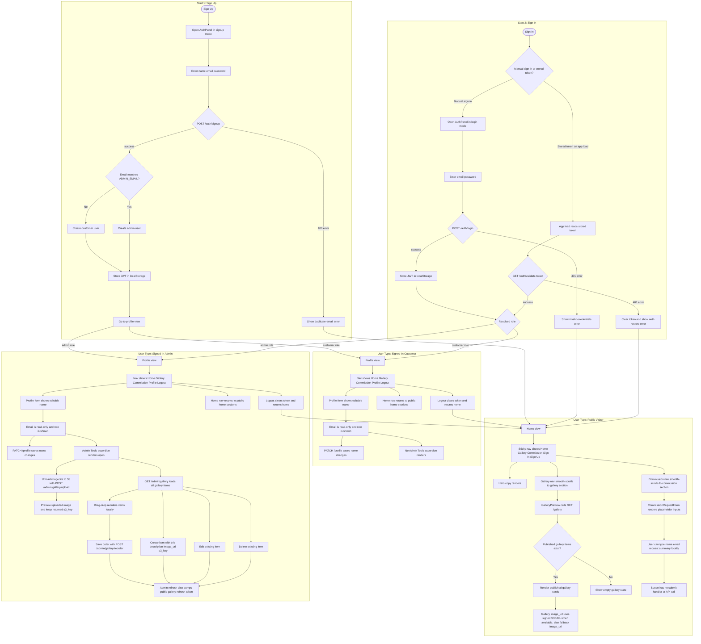

## App Flow

```mermaid
flowchart TB
  subgraph SignupFlow[Start 1: Sign Up]
    SU0([Sign Up])
    SU1[Open AuthPanel in signup mode]
    SU2[Enter name email password]
    SU3{POST /auth/signup}
    SU4[Show duplicate-email error]
    SU5{Email matches ADMIN_EMAIL?}
    SU6[Create customer user]
    SU7[Create admin user]
    SU8[Store JWT in localStorage]
    SU9[Go to profile view]
  end

  SU0 --> SU1 --> SU2 --> SU3
  SU3 -->|400 error| SU4
  SU3 -->|success| SU5
  SU5 -->|No| SU6 --> SU8
  SU5 -->|Yes| SU7 --> SU8
  SU8 --> SU9

  subgraph SigninFlow[Start 2: Sign In]
    SI0([Sign In])
    SI1{Manual sign in or stored token?}
    SI2[Open AuthPanel in login mode]
    SI3[Enter email password]
    SI4{POST /auth/login}
    SI5[Show invalid-credentials error]
    SI6[Store JWT in localStorage]
    SI7[App load reads stored token]
    SI8{GET /auth/validate-token}
    SI9[Clear token and show auth restore error]
    SI10{Resolved role}
  end

  SI0 --> SI1
  SI1 -->|Manual sign in| SI2 --> SI3 --> SI4
  SI4 -->|401 error| SI5
  SI4 -->|success| SI6 --> SI10
  SI1 -->|Stored token on app load| SI7 --> SI8
  SI8 -->|401 error| SI9
  SI8 -->|success| SI10

  subgraph VisitorFlow[User Type: Public Visitor]
    PV0[Home view]
    PV1[Sticky nav shows Home Gallery Commission Sign In Sign Up]
    PV2[Hero copy renders]
    PV3[Gallery nav smooth-scrolls to gallery section]
    PV4[Commission nav smooth-scrolls to commission section]
    PV5[GalleryPreview calls GET /gallery]
    PV6{Published gallery items exist?}
    PV7[Render published gallery cards]
    PV8[Show empty gallery state]
    PV9[Gallery image_url uses signed S3 URL when available, else fallback image_url]
    PV10[CommissionRequestForm renders placeholder inputs]
    PV11[User can type name email request summary locally]
    PV12[Button has no submit handler or API call]
  end

  PV0 --> PV1 --> PV2
  PV1 --> PV3 --> PV5
  PV1 --> PV4 --> PV10
  PV5 --> PV6
  PV6 -->|Yes| PV7 --> PV9
  PV6 -->|No| PV8
  PV10 --> PV11 --> PV12

  subgraph CustomerFlow[User Type: Signed-In Customer]
    CU0[Profile view]
    CU1[Nav shows Home Gallery Commission Profile Logout]
    CU2[Profile form shows editable name]
    CU3[Email is read-only and role is shown]
    CU4[PATCH /profile saves name changes]
    CU5[No Admin Tools accordion renders]
    CU6[Home nav returns to public home sections]
    CU7[Logout clears token and returns home]
  end

  CU0 --> CU1 --> CU2 --> CU3 --> CU4
  CU3 --> CU5
  CU1 --> CU6
  CU1 --> CU7 --> PV0

  subgraph AdminFlow[User Type: Signed-In Admin]
    AD0[Profile view]
    AD1[Nav shows Home Gallery Commission Profile Logout]
    AD2[Profile form shows editable name]
    AD3[Email is read-only and role is shown]
    AD4[PATCH /profile saves name changes]
    AD5[Admin Tools accordion renders open]
    AD6[GET /admin/gallery loads all gallery items]
    AD7[Create item with title description image_url s3_key]
    AD8[Edit existing item]
    AD9[Delete existing item]
    AD10[Upload image file to S3 with POST /admin/gallery/upload]
    AD11[Preview uploaded image and keep returned s3_key]
    AD12[Drag-drop reorders items locally]
    AD13[Save order with POST /admin/gallery/reorder]
    AD14[Admin refresh also bumps public gallery refresh token]
    AD15[Home nav returns to public home sections]
    AD16[Logout clears token and returns home]
  end

  AD0 --> AD1 --> AD2 --> AD3 --> AD4
  AD3 --> AD5 --> AD6
  AD6 --> AD7
  AD6 --> AD8
  AD6 --> AD9
  AD5 --> AD10 --> AD11
  AD6 --> AD12 --> AD13 --> AD14
  AD7 --> AD14
  AD8 --> AD14
  AD9 --> AD14
  AD1 --> AD15
  AD1 --> AD16 --> PV0

  SU9 -->|customer role| CU0
  SU9 -->|admin role| AD0
  SI10 -->|customer role| CU0
  SI10 -->|admin role| AD0
  SU4 --> PV0
  SI5 --> PV0
  SI9 --> PV0
```
