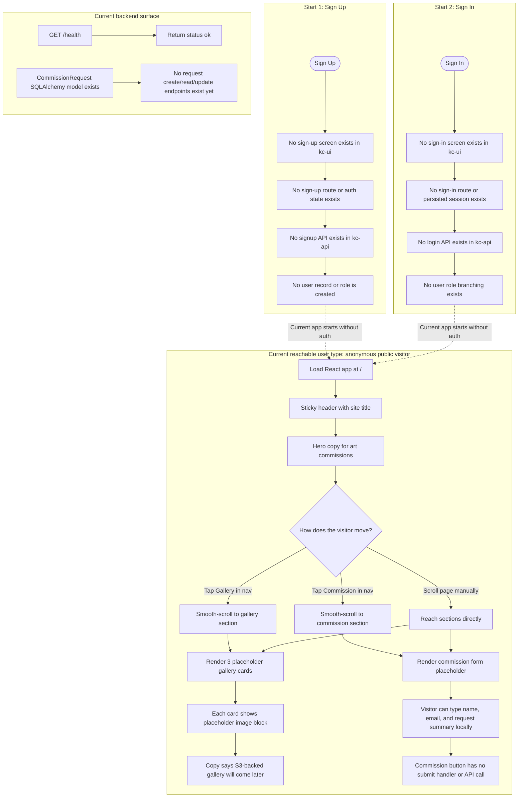

## App Flow

```mermaid
flowchart TD
  subgraph SignupFlow[Start 1: Sign Up]
    SU0([Sign Up]) --> SU1[No sign-up screen exists in kc-ui]
    SU1 --> SU2[No sign-up route or auth state exists]
    SU2 --> SU3[No signup API exists in kc-api]
    SU3 --> SU4[No user record or role is created]
  end

  subgraph SigninFlow[Start 2: Sign In]
    SI0([Sign In]) --> SI1[No sign-in screen exists in kc-ui]
    SI1 --> SI2[No sign-in route or persisted session exists]
    SI2 --> SI3[No login API exists in kc-api]
    SI3 --> SI4[No user role branching exists]
  end

  SU4 -. Current app starts without auth .-> APP0
  SI4 -. Current app starts without auth .-> APP0

  subgraph PublicVisitorFlow[Current reachable user type: anonymous public visitor]
    APP0[Load React app at /] --> APP1[Sticky header with site title]
    APP1 --> APP2[Hero copy for art commissions]
    APP2 --> APP3{How does the visitor move?}

    APP3 -->|Tap Gallery in nav| APP4[Smooth-scroll to gallery section]
    APP3 -->|Tap Commission in nav| APP8[Smooth-scroll to commission section]
    APP3 -->|Scroll page manually| APP12[Reach sections directly]

    APP4 --> APP5[Render 3 placeholder gallery cards]
    APP5 --> APP6[Each card shows placeholder image block]
    APP6 --> APP7[Copy says S3-backed gallery will come later]

    APP8 --> APP9[Render commission form placeholder]
    APP9 --> APP10[Visitor can type name, email, and request summary locally]
    APP10 --> APP11[Commission button has no submit handler or API call]

    APP12 --> APP5
    APP12 --> APP9
  end

  subgraph BackendSurface[Current backend surface]
    API0[GET /health] --> API1[Return status ok]
    API2[CommissionRequest SQLAlchemy model exists] --> API3[No request create/read/update endpoints exist yet]
  end
```
