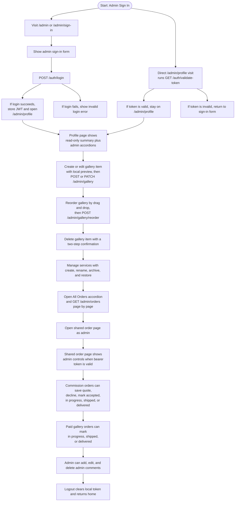
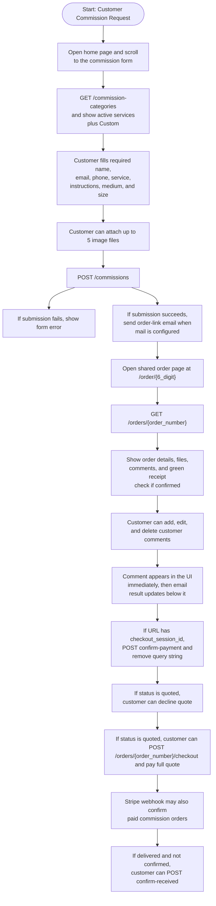
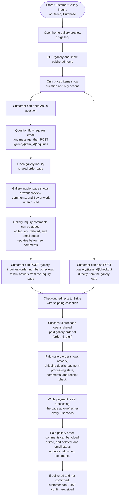

## Admin Flow

```mermaid
flowchart TB
  A0([Start: Admin Sign In])
  A1[Visit /admin or /admin/sign-in]
  A2[Show admin sign-in form]
  A3[POST /auth/login]
  A4["If login succeeds,<br/>store JWT and open<br/>/admin/profile"]
  A5[If login fails, show invalid login error]
  A6["Direct /admin/profile visit<br/>runs GET /auth/validate-token"]
  A7[If token is valid, stay on /admin/profile]
  A8[If token is invalid, return to sign-in form]
  A9["Profile page shows<br/>read-only summary plus<br/>admin accordions"]
  A10["Create or edit gallery item<br/>with local preview, then<br/>POST or PATCH /admin/gallery"]
  A11["Reorder gallery by drag and drop,<br/>then POST /admin/gallery/reorder"]
  A12[Delete gallery item with a two-step confirmation]
  A13[Manage services with create, rename, archive, and restore]
  A14["Open All Orders accordion<br/>and GET /admin/orders<br/>page by page"]
  A15[Open shared order page as admin]
  A16["Shared order page shows<br/>admin controls when bearer<br/>token is valid"]
  A17["Commission orders can save quote,<br/>decline, mark accepted,<br/>in progress, shipped, or delivered"]
  A18["Paid gallery orders can mark<br/>in progress, shipped,<br/>or delivered"]
  A19[Admin can add, edit, and delete admin comments]
  A20[Logout clears local token and returns home]

  A0 --> A1 --> A2 --> A3
  A3 --> A4
  A3 --> A5
  A0 --> A6
  A6 --> A7
  A6 --> A8
  A4 --> A9 --> A10 --> A11 --> A12 --> A13 --> A14 --> A15 --> A16 --> A17 --> A18 --> A19 --> A20
  A7 --> A9
```

## Commission Flow

```mermaid
flowchart TB
  B0([Start: Customer Commission Request])
  B1["Open home page and scroll<br/>to the commission form"]
  B2["GET /commission-categories<br/>and show active services<br/>plus Custom"]
  B3["Customer fills required name,<br/>email, phone, service,<br/>instructions, medium, and size"]
  B4[Customer can attach up to 5 image files]
  B5[POST /commissions]
  B6[If submission fails, show form error]
  B7["If submission succeeds,<br/>send order-link email when<br/>mail is configured"]
  B8["Open shared order page at /order/{6_digit}"]
  B9["GET /orders/{order_number}"]
  B10["Show order details, files,<br/>comments, and green receipt<br/>check if confirmed"]
  B11["Customer can add, edit,<br/>and delete customer comments"]
  B12["Comment appears in the UI<br/>immediately, then email<br/>result updates below it"]
  B13["If URL has checkout_session_id,<br/>POST confirm-payment and<br/>remove query string"]
  B14["If status is quoted,<br/>customer can decline quote"]
  B15["If status is quoted, customer can POST /orders/{order_number}/checkout and pay full quote"]
  B16["Stripe webhook may also confirm<br/>paid commission orders"]
  B17["If delivered and not confirmed,<br/>customer can POST confirm-received"]

  B0 --> B1 --> B2 --> B3 --> B4 --> B5
  B5 --> B6
  B5 --> B7 --> B8 --> B9 --> B10 --> B11 --> B12 --> B13 --> B14 --> B15 --> B16 --> B17
```

## Gallery Flow

```mermaid
flowchart TB
  C0([Start: Customer Gallery Inquiry<br/>or Gallery Purchase])
  C1["Open home gallery preview<br/>or /gallery"]
  C2[GET /gallery and show published items]
  C3["Only priced items show<br/>question and buy actions"]
  C4[Customer can open Ask a question]
  C5["Question flow requires email<br/>and message, then POST<br/>/gallery/{item_id}/inquiries"]
  C6["Open gallery inquiry<br/>shared order page"]
  C7["Gallery inquiry page shows artwork preview,<br/>comments, and Buy artwork<br/>when priced"]
  C8["Gallery inquiry comments can be added,<br/>edited, and deleted, and email status<br/>updates below new comments"]
  C9["Customer can POST /gallery-inquiries/{order_number}/checkout to buy artwork from the inquiry page"]
  C10["Customer can also POST<br/>/gallery/{item_id}/checkout<br/>directly from the gallery card"]
  C11["Checkout redirects to Stripe<br/>with shipping collection"]
  C12["Successful purchase opens shared<br/>paid gallery order at<br/>/order/{6_digit}"]
  C13["Paid gallery order shows artwork,<br/>shipping details, payment-processing state,<br/>comments, and receipt check"]
  C14["While payment is still processing,<br/>the page auto-refreshes<br/>every 3 seconds"]
  C15["Paid gallery order comments can be added,<br/>edited, and deleted, and email status<br/>updates below new comments"]
  C16["If delivered and not confirmed,<br/>customer can POST confirm-received"]

  C0 --> C1 --> C2 --> C3 --> C4 --> C5 --> C6 --> C7 --> C8 --> C9 --> C11 --> C12 --> C13 --> C14 --> C15 --> C16
  C3 --> C10 --> C11
```
