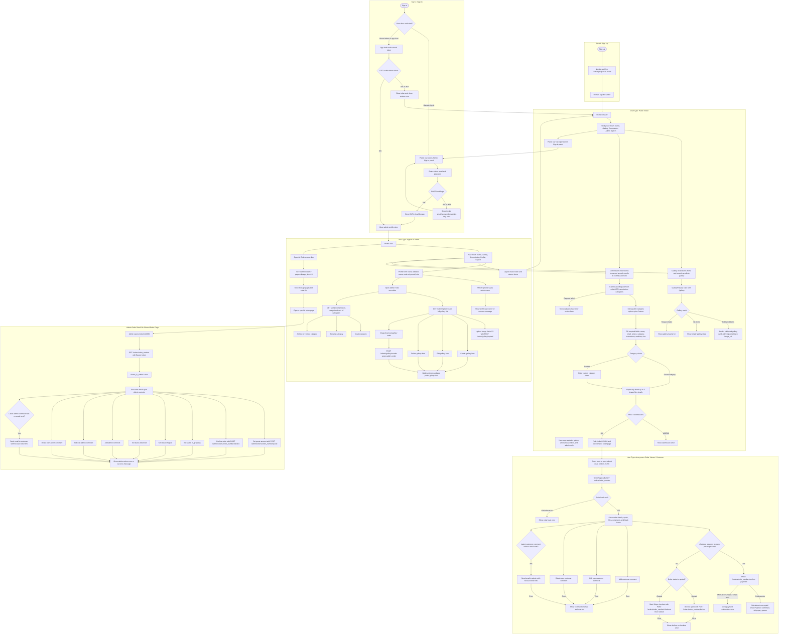

## App Flow

```mermaid
flowchart TB
  subgraph StartSignup[Start 1: Sign Up]
    SU0([Sign Up])
    SU1[No sign-up UI or /auth/signup route exists]
    SU2[Remain a public visitor]
  end

  SU0 --> SU1 --> SU2

  subgraph StartSignin[Start 2: Sign In]
    SI0([Sign In])
    SI1{How does auth start?}
    SI2[Public nav opens Admin Sign In panel]
    SI3[Enter admin email and password]
    SI4{POST /auth/login}
    SI5[Show invalid email/password or admin-only error]
    SI6[Store JWT in localStorage]
    SI7[Open admin profile view]
    SI8[App load reads stored token]
    SI9{GET /auth/validate-token}
    SI10[Clear token and show restore error]
  end

  SI0 --> SI1
  SI1 -->|Manual sign in| SI2 --> SI3 --> SI4
  SI4 -->|401 or 403| SI5
  SI4 -->|200| SI6 --> SI7
  SI1 -->|Stored token on app load| SI8 --> SI9
  SI9 -->|401 or 403| SI10
  SI9 -->|200| SI7

  subgraph VisitorFlow[User Type: Public Visitor]
    PV0[Home view at /]
    PV1[Sticky nav shows brand, Gallery, Commission, Admin Sign In]
    PV2[Hero copy explains gallery, anonymous orders, and admin tools]
    PV3[Gallery click returns home and smooth-scrolls to gallery]
    PV4[Commission click returns home and smooth-scrolls to commission form]
    PV5[GalleryPreview calls GET /gallery]
    PV6{Gallery result}
    PV7[Render published gallery cards with signed/fallback image_url]
    PV8[Show empty gallery state]
    PV9[Show gallery load error]
    PV10[CommissionRequestForm calls GET /commission-categories]
    PV11[Show public category options plus Custom]
    PV12[Show category load error on the form]
    PV13[Fill required fields: name, email, phone, category, instructions, medium, size]
    PV14{Category choice}
    PV15[Enter custom category name]
    PV16[Optionally attach up to 5 image files locally]
    PV17{POST /commissions}
    PV18[Show submission error]
    PV19[Push /order/123456 and open shared order page]
    PV20[Public nav can open Admin Sign In panel]
  end

  PV0 --> PV1
  PV1 --> PV3 --> PV5
  PV1 --> PV4 --> PV10
  PV1 --> PV20 --> SI2
  PV5 --> PV6
  PV6 -->|Published items| PV7
  PV6 -->|No items| PV8
  PV6 -->|Request failed| PV9
  PV10 --> PV11
  PV10 -->|Request failed| PV12
  PV11 --> PV13 --> PV14
  PV14 -->|Saved category| PV16
  PV14 -->|Custom| PV15 --> PV16
  PV16 --> PV17
  PV17 -->|400/500| PV18
  PV17 -->|200| PV19

  subgraph OrderFlow[User Type: Anonymous Order Viewer / Customer]
    OV0[Direct route or post-submit route /order/123456]
    OV1[OrderPage calls GET /orders/order_number]
    OV2{Order load result}
    OV3[Show order details, quote, files, comments, and Back home]
    OV4[Show order load error]
    OV5{checkout_session_id query param present?}
    OV6[POST /orders/order_number/confirm-payment]
    OV7[Set status to accepted, show Payment confirmed, strip query param]
    OV8[Show payment confirmation error]
    OV9{Order status is quoted?}
    OV10[Decline quote with POST /orders/order_number/decline]
    OV11[Start Stripe checkout with POST /orders/order_number/checkout then redirect]
    OV12[Show decline or checkout error]
    OV13[Add customer comment]
    OV14[Edit own customer comment]
    OV15[Delete own customer comment]
    OV16{Latest customer comment with no email sent?}
    OV17[Send email to admin with focused order link]
    OV18[Show comment or email action error]
  end

  OV0 --> OV1 --> OV2
  OV2 -->|200| OV3
  OV2 -->|404/other error| OV4
  OV3 --> OV5
  OV5 -->|Yes| OV6
  OV6 -->|Paid session| OV7
  OV6 -->|Mismatch / unpaid / Stripe error| OV8
  OV5 -->|No| OV9
  OV9 -->|Quoted| OV10
  OV9 -->|Quoted| OV11
  OV10 -->|Error| OV12
  OV11 -->|Error| OV12
  OV3 --> OV13
  OV3 --> OV14
  OV3 --> OV15
  OV3 --> OV16
  OV16 -->|Yes| OV17
  OV13 -->|Error| OV18
  OV14 -->|Error| OV18
  OV15 -->|Error| OV18
  OV17 -->|Error| OV18

  subgraph AdminFlow[User Type: Signed-In Admin]
    AD0[Profile view]
    AD1[Nav shows brand, Gallery, Commission, Profile, Logout]
    AD2[Profile form shows editable name, read-only email, role]
    AD3[PATCH /profile saves admin name]
    AD4[Show profile save error or success message]
    AD5[Open Admin Tools accordion]
    AD6[GET /admin/gallery loads full gallery list]
    AD7[Upload image file to S3 with POST /admin/gallery/upload]
    AD8[Create gallery item]
    AD9[Edit gallery item]
    AD10[Delete gallery item]
    AD11[Drag-drop local gallery order]
    AD12[POST /admin/gallery/reorder saves gallery order]
    AD13[Gallery refresh updates public gallery feed]
    AD14[GET /admin/commission-categories loads all categories]
    AD15[Create category]
    AD16[Rename category]
    AD17[Archive or restore category]
    AD18[Open All Orders accordion]
    AD19[GET /admin/orders?page=n&page_size=10]
    AD20[Move through paginated order list]
    AD21[Open a specific order page]
    AD22[Logout clears token and returns home]
  end

  AD0 --> AD1 --> AD2 --> AD3 --> AD4
  AD2 --> AD5
  AD5 --> AD6
  AD6 --> AD7
  AD6 --> AD8 --> AD13
  AD6 --> AD9 --> AD13
  AD6 --> AD10 --> AD13
  AD6 --> AD11 --> AD12 --> AD13
  AD5 --> AD14
  AD14 --> AD15
  AD14 --> AD16
  AD14 --> AD17
  AD0 --> AD18 --> AD19 --> AD20 --> AD21
  AD1 --> AD22 --> PV0
  AD1 --> PV3
  AD1 --> PV4

  subgraph AdminOrderFlow[Admin Order Detail On Shared Order Page]
    AO0[Admin opens /order/123456]
    AO1[GET /orders/order_number with Bearer token]
    AO2[viewer_is_admin is true]
    AO3[See order details plus Admin controls]
    AO4[Set quote amount with POST /admin/orders/order_number/quote]
    AO5[Decline order with POST /admin/orders/order_number/decline]
    AO6[Set status in_progress]
    AO7[Set status shipped]
    AO8[Set status delivered]
    AO9[Add admin comment]
    AO10[Edit own admin comment]
    AO11[Delete own admin comment]
    AO12{Latest admin comment with no email sent?}
    AO13[Send email to customer with focused order link]
    AO14[Show admin action error or success message]
  end

  AO0 --> AO1 --> AO2 --> AO3
  AO3 --> AO4 --> AO14
  AO3 --> AO5 --> AO14
  AO3 --> AO6 --> AO14
  AO3 --> AO7 --> AO14
  AO3 --> AO8 --> AO14
  AO3 --> AO9 --> AO14
  AO3 --> AO10 --> AO14
  AO3 --> AO11 --> AO14
  AO3 --> AO12
  AO12 -->|Yes| AO13 --> AO14

  SU2 --> PV0
  SI5 --> SI2
  SI10 --> PV0
  SI7 --> AD0
  PV19 --> OV0
  AD21 --> AO0
```
