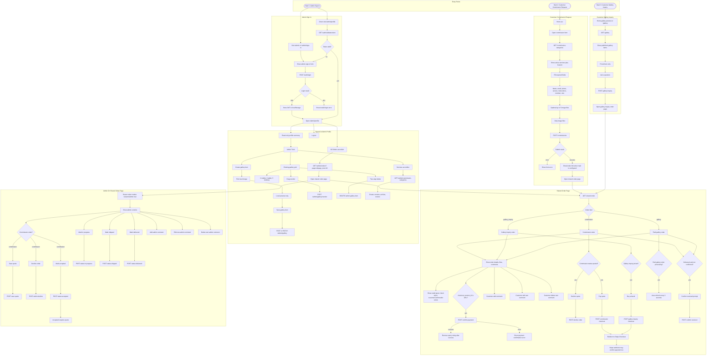

## App Flow

```mermaid
flowchart TB
  subgraph EntryPoints[Entry Points]
    direction TB
    A0([Start 1: Admin Sign In])
    B0([Start 2: Customer Commission Request])
    C0([Start 3: Customer Gallery Inquiry])
  end

  subgraph AdminSignIn[Admin Sign In]
    A1[Visit /admin or /admin/sign-in]
    A2[Show admin sign-in form]
    A3[POST /auth/login]
    A4{Login result}
    A5[Store JWT in localStorage]
    A6[Open /admin/profile]
    A7[Show invalid login error]
    A8[Direct visit /admin/profile]
    A9[GET /auth/validate-token]
    A10{Token valid?}
  end

  A0 --> A1 --> A2 --> A3 --> A4
  A4 -->|200| A5 --> A6
  A4 -->|401| A7
  A0 --> A8 --> A9 --> A10
  A10 -->|yes| A6
  A10 -->|no| A2

  subgraph AdminProfile[Signed-In Admin Profile]
    P1[Read-only profile summary]
    P2[Admin Tools]
    P3[Create gallery item]
    P4[Pick local image]
    P5[Local preview only]
    P6[Save gallery item]
    P7[POST or PATCH /admin/gallery]
    P8[Existing gallery grid]
    P9[2 mobile, 3 tablet, 5 desktop]
    P10[Drag reorder]
    P11[POST /admin/gallery/reorder]
    P12[Two-step delete]
    P13[DELETE admin gallery item]
    P14[Services accordion]
    P15[GET /admin/commission-categories]
    P16[Create, rename, archive, restore]
    P17[All Orders accordion]
    P18[GET /admin/orders?page=n&page_size=10]
    P19[Open shared order page]
    P20[Logout]
  end

  A6 --> P1 --> P2
  P2 --> P3 --> P4 --> P5 --> P6 --> P7
  P2 --> P8 --> P9
  P8 --> P10 --> P11
  P8 --> P12 --> P13
  P2 --> P14 --> P15 --> P16
  A6 --> P17 --> P18 --> P19
  A6 --> P20

  subgraph CommissionRequest[Customer Commission Request]
    B1[Home at /]
    B2[Open commission form]
    B3[GET /commission-categories]
    B4[Show active services plus Custom]
    B5[Fill required fields]
    B6[Name, email, phone, service, instructions, medium, size]
    B7[Optional up to 5 image files]
    B8[Only image files]
    B9[POST /commissions]
    B10{Submit result}
    B11[Show form error]
    B12[Email order link when mail is configured]
    B13[Open shared order page]
  end

  B0 --> B1 --> B2 --> B3 --> B4 --> B5 --> B6 --> B7 --> B8 --> B9 --> B10
  B10 -->|error| B11
  B10 -->|success| B12 --> B13

  subgraph GalleryInquiryStart[Customer Gallery Inquiry]
    C1[Home gallery preview or /gallery]
    C2[GET /gallery]
    C3[Show published gallery items]
    C4[Priced item only]
    C5[Ask a question]
    C6[POST gallery inquiry]
    C7[Open gallery inquiry order page]
  end

  C0 --> C1 --> C2 --> C3 --> C4 --> C5 --> C6 --> C7

  subgraph SharedOrderPage[Shared Order Page]
    O1[GET shared order]
    O2{Order kind}
    O3[Commission order]
    O4[Gallery inquiry order]
    O5[Paid gallery order]
    O6[Show order details, files, comments]
    O7[Show small green check when customerConfirmedAt exists]
    O8{checkout_session_id in URL?}
    O9[POST confirm payment]
    O10[Remove query string after success]
    O11[Show payment confirmation error]
    O12[Customer add comment]
    O13[Customer edit own comment]
    O14[Customer delete own comment]
    O15{Commission status quoted?}
    O16[Decline quote]
    O17[POST decline order]
    O18[Pay quote]
    O19[POST commission checkout]
    O20[Redirect to Stripe Checkout]
    O21[Stripe webhook may confirm payment too]
    O22{Gallery inquiry priced?}
    O23[Buy artwork]
    O24[POST gallery inquiry checkout]
    O25{Paid gallery order processing?}
    O26[Auto-refresh every 3 seconds]
    O27{Delivered and not confirmed?}
    O28[Confirm received prompt]
    O29[POST confirm received]
  end

  B13 --> O1
  C7 --> O1
  P19 --> O1
  O1 --> O2
  O2 -->|commission| O3 --> O6
  O2 -->|gallery_inquiry| O4 --> O6
  O2 -->|gallery| O5 --> O6
  O6 --> O7
  O6 --> O8
  O8 -->|yes| O9
  O9 -->|success| O10
  O9 -->|error| O11
  O6 --> O12
  O6 --> O13
  O6 --> O14
  O3 --> O15
  O15 -->|yes| O16 --> O17
  O15 -->|yes| O18 --> O19 --> O20 --> O21
  O4 --> O22
  O22 -->|yes| O23 --> O24 --> O20
  O5 --> O25
  O25 -->|yes| O26
  O3 --> O27
  O5 --> O27
  O27 -->|yes| O28 --> O29

  subgraph AdminOnSharedOrder[Admin On Shared Order Page]
    AO1[Bearer token makes viewerIsAdmin true]
    AO2[Show admin controls]
    AO3{Commission order?}
    AO4[Save quote]
    AO5[POST save quote]
    AO6[Decline order]
    AO7[POST admin decline]
    AO8[Mark accepted]
    AO9[POST status accepted]
    AO10[Accepted requires quote]
    AO11[Mark in progress]
    AO12[Mark shipped]
    AO13[Mark delivered]
    AO14[POST status in progress]
    AO15[POST status shipped]
    AO16[POST status delivered]
    AO17[Add admin comment]
    AO18[Edit own admin comment]
    AO19[Delete own admin comment]
  end

  P19 --> AO1 --> AO2 --> AO3
  AO3 -->|commission| AO4 --> AO5
  AO3 -->|commission| AO6 --> AO7
  AO3 -->|commission| AO8 --> AO9 --> AO10
  AO2 --> AO11 --> AO14
  AO2 --> AO12 --> AO15
  AO2 --> AO13 --> AO16
  AO2 --> AO17
  AO2 --> AO18
  AO2 --> AO19
```
