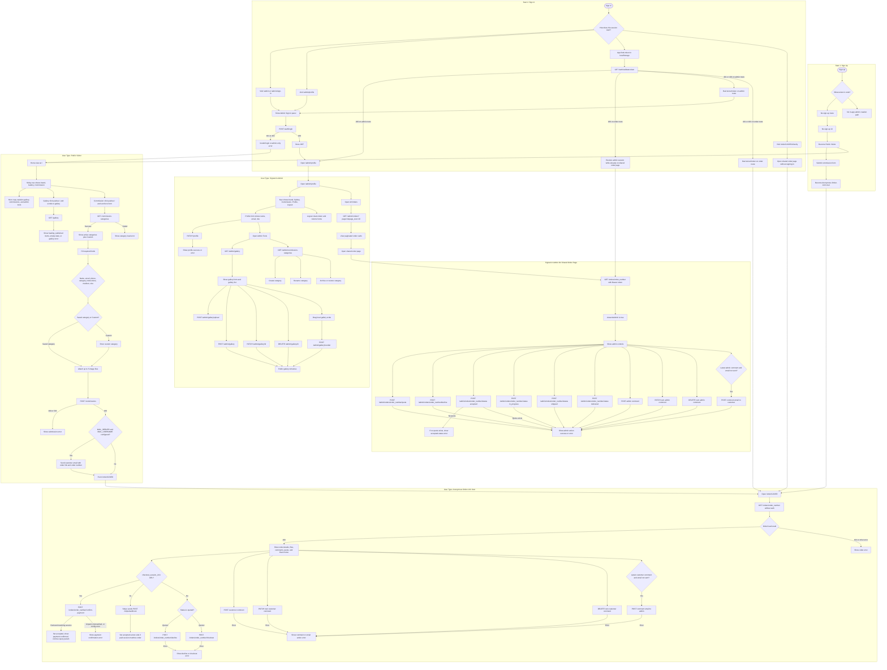

## App Flow

```mermaid
flowchart TB
  subgraph StartSignup[Start 1: Sign Up]
    SU0([Sign Up])
    SU1{What exists in code?}
    SU2[No sign-up route]
    SU3[No sign-up UI]
    SU4[Become Public Visitor]
    SU5[Submit commission form]
    SU6[Become Anonymous Order-Link User]
    SU7[No in-app admin creation path]
  end

  SU0 --> SU1
  SU1 --> SU2 --> SU3 --> SU4
  SU4 --> SU5 --> SU6
  SU1 --> SU7

  subgraph StartSignin[Start 2: Sign In]
    SI0([Sign In])
    SI1{How does the session start?}
    SI2[Visit /admin or /admin/sign-in]
    SI3[Visit /admin/profile]
    SI4[App finds token in localStorage]
    SI5[Visit /order/123456 directly]
    SI6[Show Admin Sign In panel]
    SI7[POST /auth/login]
    SI8[GET /auth/validate-token]
    SI9[Invalid login or admin-only error]
    SI10[Bad stored token on admin route]
    SI11[Store JWT]
    SI12[Open /admin/profile]
    SI13[Open shared order page without signing in]
    SI14[Restore admin session while already on shared order page]
    SI15[Bad stored token on order route]
  end

  SI0 --> SI1
  SI1 --> SI2 --> SI6 --> SI7
  SI1 --> SI3 --> SI6
  SI1 --> SI4 --> SI8
  SI1 --> SI5 --> SI13
  SI7 -->|401 or 403| SI9
  SI7 -->|200| SI11 --> SI12
  SI8 -->|200 on admin route| SI12
  SI8 -->|200 on order route| SI14
  SI8 -->|401 or 403 on admin route| SI10
  SI8 -->|401 or 403 on order route| SI15

  subgraph PublicVisitor[User Type: Public Visitor]
    PV0[Home view at /]
    PV1[Sticky nav shows brand, Gallery, Commission]
    PV2[Hero copy explains gallery, commissions, and admin tools]
    PV3[Gallery click pushes / and scrolls to gallery]
    PV4[Commission click pushes / and scrolls to form]
    PV5[GET /gallery]
    PV6[Show loading, published items, empty state, or gallery error]
    PV7[GET /commission-categories]
    PV8[Show active categories plus Custom]
    PV9[Show category load error]
    PV10[Fill required fields]
    PV11{Name, email, phone, category, instructions, medium, size}
    PV12{Saved category or Custom?}
    PV13[Enter custom category]
    PV14[Attach up to 5 image files]
    PV15[POST /commissions]
    PV16[Show submission error]
    PV17{MAIL_SERVER and MAIL_USERNAME configured?}
    PV18[Send customer email with order link and order number]
    PV19[Push /order/123456]
  end

  PV0 --> PV1 --> PV2
  PV1 --> PV3 --> PV5 --> PV6
  PV1 --> PV4 --> PV7
  PV7 -->|Success| PV8 --> PV10 --> PV11 --> PV12
  PV7 -->|Failed| PV9
  PV12 -->|Saved category| PV14
  PV12 -->|Custom| PV13 --> PV14
  PV14 --> PV15
  PV15 -->|400 or 500| PV16
  PV15 -->|200| PV17
  PV17 -->|Yes| PV18 --> PV19
  PV17 -->|No| PV19

  subgraph AnonymousOrderUser[User Type: Anonymous Order-Link User]
    OV0[Open /order/123456]
    OV1[GET /orders/order_number without auth]
    OV2{Order load result}
    OV3[Show order details, files, comments, quote, and Back home]
    OV4[Show order error]
    OV5{checkout_session_id in URL?}
    OV6[POST /orders/order_number/confirm-payment]
    OV7[Set accepted, show payment confirmed, remove query param]
    OV8[Show payment confirmation error]
    OV9[Stripe sends POST /stripe/webhook]
    OV10[Set accepted server-side if paid session matches order]
    OV11{Status is quoted?}
    OV12[POST /orders/order_number/decline]
    OV13[POST /orders/order_number/checkout]
    OV14[Show decline or checkout error]
    OV15[POST customer comment]
    OV16[PATCH own customer comment]
    OV17[DELETE own customer comment]
    OV18{Latest customer comment and email not sent?}
    OV19[POST comment email to admin]
    OV20[Show comment or email action error]
  end

  OV0 --> OV1 --> OV2
  OV2 -->|200| OV3
  OV2 -->|404 or other error| OV4
  OV3 --> OV5
  OV5 -->|Yes| OV6
  OV6 -->|Paid and matching session| OV7
  OV6 -->|Unpaid, mismatched, or config error| OV8
  OV5 -->|No| OV9
  OV9 --> OV10
  OV5 -->|No| OV11
  OV11 -->|Quoted| OV12
  OV11 -->|Quoted| OV13
  OV12 -->|Error| OV14
  OV13 -->|Error| OV14
  OV3 --> OV15
  OV3 --> OV16
  OV3 --> OV17
  OV3 --> OV18
  OV15 -->|Error| OV20
  OV16 -->|Error| OV20
  OV17 -->|Error| OV20
  OV18 -->|Yes| OV19
  OV19 -->|Error| OV20

  subgraph SignedInAdmin[User Type: Signed-In Admin]
    AD0[Open /admin/profile]
    AD1[Nav shows brand, Gallery, Commission, Profile, Logout]
    AD2[Profile form shows name, email, role]
    AD3[PATCH /profile]
    AD4[Show profile success or error]
    AD5[Open Admin Tools]
    AD6[GET /admin/gallery]
    AD7[Show gallery form and gallery list]
    AD8[POST /admin/gallery/upload]
    AD9[POST /admin/gallery]
    AD10[PATCH /admin/gallery/id]
    AD11[DELETE /admin/gallery/id]
    AD12[Drag local gallery order]
    AD13[POST /admin/gallery/reorder]
    AD14[Public gallery refreshes]
    AD15[GET /admin/commission-categories]
    AD16[Create category]
    AD17[Rename category]
    AD18[Archive or restore category]
    AD19[Open All Orders]
    AD20[GET /admin/orders?page=n&page_size=10]
    AD21[View paginated order cards]
    AD22[Open shared order page]
    AD23[Logout clears token and returns home]
  end

  AD0 --> AD1 --> AD2 --> AD3 --> AD4
  AD2 --> AD5
  AD5 --> AD6 --> AD7
  AD7 --> AD8
  AD7 --> AD9 --> AD14
  AD7 --> AD10 --> AD14
  AD7 --> AD11 --> AD14
  AD7 --> AD12 --> AD13 --> AD14
  AD5 --> AD15
  AD15 --> AD16
  AD15 --> AD17
  AD15 --> AD18
  AD0 --> AD19 --> AD20 --> AD21 --> AD22
  AD1 --> AD23

  subgraph AdminOnOrderPage[Signed-In Admin On Shared Order Page]
    AO0[GET /orders/order_number with Bearer token]
    AO1[viewerIsAdmin is true]
    AO2[Show admin controls]
    AO3[POST /admin/orders/order_number/quote]
    AO4[POST /admin/orders/order_number/decline]
    AO5[POST /admin/orders/order_number/status accepted]
    AO6[If no quote exists, show accepted-status error]
    AO7[POST /admin/orders/order_number/status in_progress]
    AO8[POST /admin/orders/order_number/status shipped]
    AO9[POST /admin/orders/order_number/status delivered]
    AO10[POST admin comment]
    AO11[PATCH own admin comment]
    AO12[DELETE own admin comment]
    AO13{Latest admin comment and email not sent?}
    AO14[POST comment email to customer]
    AO15[Show admin action success or error]
  end

  AO0 --> AO1 --> AO2
  AO2 --> AO3 --> AO15
  AO2 --> AO4 --> AO15
  AO2 --> AO5
  AO5 -->|No quote| AO6
  AO5 -->|Quote exists| AO15
  AO2 --> AO7 --> AO15
  AO2 --> AO8 --> AO15
  AO2 --> AO9 --> AO15
  AO2 --> AO10 --> AO15
  AO2 --> AO11 --> AO15
  AO2 --> AO12 --> AO15
  AO2 --> AO13
  AO13 -->|Yes| AO14 --> AO15

  SU4 --> PV0
  SU6 --> OV0
  SI9 --> PV0
  SI10 --> SI6
  SI14 --> AO0
  SI15 --> OV0
  SI12 --> AD0
  SI13 --> OV0
  PV19 --> OV0
  AD22 --> AO0
```
