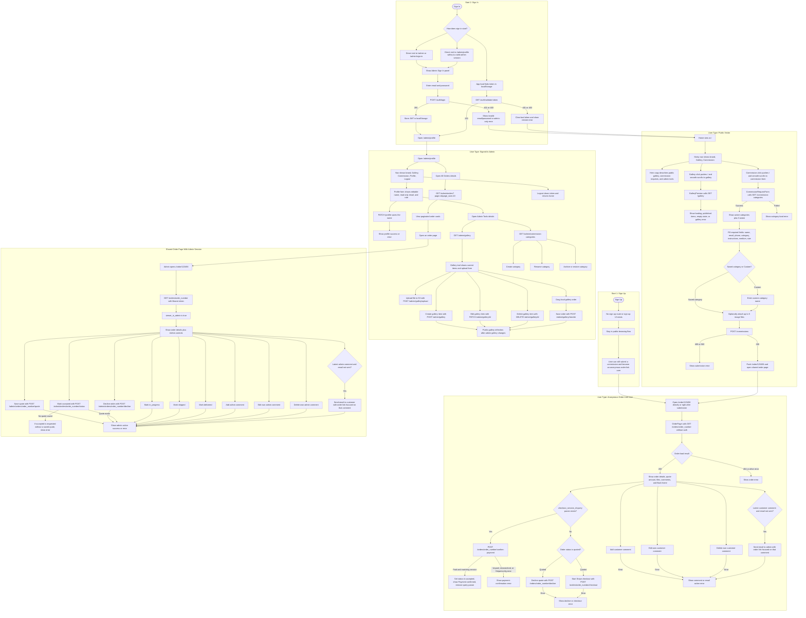

## App Flow

```mermaid
flowchart TB
  subgraph StartSignup[Start 1: Sign Up]
    SU0([Sign Up])
    SU1[No sign-up route or sign-up UI exists]
    SU2[Stay in public browsing flow]
    SU3[User can still submit a commission and become an anonymous order-link user]
  end

  SU0 --> SU1 --> SU2 --> SU3

  subgraph StartSignin[Start 2: Sign In]
    SI0([Sign In])
    SI1{How does sign in start?}
    SI2[Direct visit to /admin or /admin/sign-in]
    SI3[Direct visit to /admin/profile without a valid admin session]
    SI4[App load finds token in localStorage]
    SI5[Show Admin Sign In panel]
    SI6[Enter email and password]
    SI7[POST /auth/login]
    SI8[Show invalid email/password or admin-only error]
    SI9[Store JWT in localStorage]
    SI10[Open /admin/profile]
    SI11[GET /auth/validate-token]
    SI12[Clear bad token and show restore error]
  end

  SI0 --> SI1
  SI1 --> SI2 --> SI5
  SI1 --> SI3 --> SI5
  SI1 --> SI4 --> SI11
  SI5 --> SI6 --> SI7
  SI7 -->|401 or 403| SI8
  SI7 -->|200| SI9 --> SI10
  SI11 -->|401 or 403| SI12
  SI11 -->|200| SI10

  subgraph VisitorFlow[User Type: Public Visitor]
    PV0[Home view at /]
    PV1[Sticky nav shows brand, Gallery, Commission]
    PV2[Hero copy describes public gallery, commission requests, and admin tools]
    PV3[Gallery click pushes / and smooth-scrolls to gallery]
    PV4[Commission click pushes / and smooth-scrolls to commission form]
    PV5[GalleryPreview calls GET /gallery]
    PV6[Show loading, published items, empty state, or gallery error]
    PV7[CommissionRequestForm calls GET /commission-categories]
    PV8[Show active categories plus Custom]
    PV9[Show category-load error]
    PV10[Fill required fields: name, email, phone, category, instructions, medium, size]
    PV11{Saved category or Custom?}
    PV12[Enter custom category name]
    PV13[Optionally attach up to 5 image files]
    PV14[POST /commissions]
    PV15[Show submission error]
    PV16[Push /order/123456 and open shared order page]
  end

  PV0 --> PV1 --> PV2
  PV1 --> PV3 --> PV5 --> PV6
  PV1 --> PV4 --> PV7
  PV7 -->|Success| PV8 --> PV10 --> PV11
  PV7 -->|Failed| PV9
  PV11 -->|Saved category| PV13
  PV11 -->|Custom| PV12 --> PV13
  PV13 --> PV14
  PV14 -->|400 or 500| PV15
  PV14 -->|200| PV16

  subgraph OrderFlow[User Type: Anonymous Order-Link User]
    OV0[Open /order/123456 directly or right after submission]
    OV1[OrderPage calls GET /orders/order_number without auth]
    OV2{Order load result}
    OV3[Show order details, quote amount, files, comments, and Back home]
    OV4[Show order error]
    OV5{checkout_session_id query param exists?}
    OV6[POST /orders/order_number/confirm-payment]
    OV7[Set status to accepted, show Payment confirmed, remove query param]
    OV8[Show payment-confirmation error]
    OV9{Order status is quoted?}
    OV10[Decline quote with POST /orders/order_number/decline]
    OV11[Start Stripe checkout with POST /orders/order_number/checkout]
    OV12[Show decline or checkout error]
    OV13[Add customer comment]
    OV14[Edit own customer comment]
    OV15[Delete own customer comment]
    OV16{Latest customer comment and email not sent?}
    OV17[Send email to admin with order link focused on that comment]
    OV18[Show comment or email action error]
  end

  OV0 --> OV1 --> OV2
  OV2 -->|200| OV3
  OV2 -->|404 or other error| OV4
  OV3 --> OV5
  OV5 -->|Yes| OV6
  OV6 -->|Paid and matching session| OV7
  OV6 -->|Unpaid, mismatched, or Stripe/config error| OV8
  OV5 -->|No| OV9
  OV9 -->|Quoted| OV10
  OV9 -->|Quoted| OV11
  OV10 -->|Error| OV12
  OV11 -->|Error| OV12
  OV3 --> OV13
  OV3 --> OV14
  OV3 --> OV15
  OV3 --> OV16
  OV13 -->|Error| OV18
  OV14 -->|Error| OV18
  OV15 -->|Error| OV18
  OV16 -->|Yes| OV17 --> OV18

  subgraph AdminFlow[User Type: Signed-In Admin]
    AD0[Open /admin/profile]
    AD1[Nav shows brand, Gallery, Commission, Profile, Logout]
    AD2[Profile form shows editable name, read-only email, and role]
    AD3[PATCH /profile saves the name]
    AD4[Show profile success or error]
    AD5[Open Admin Tools details]
    AD6[GET /admin/gallery]
    AD7[Gallery tool shows current items and upload form]
    AD8[Upload file to S3 with POST /admin/gallery/upload]
    AD9[Create gallery item with POST /admin/gallery]
    AD10[Edit gallery item with PATCH /admin/gallery/id]
    AD11[Delete gallery item with DELETE /admin/gallery/id]
    AD12[Drag local gallery order]
    AD13[Save order with POST /admin/gallery/reorder]
    AD14[Public gallery refreshes after admin gallery changes]
    AD15[GET /admin/commission-categories]
    AD16[Create category]
    AD17[Rename category]
    AD18[Archive or restore category]
    AD19[Open All Orders details]
    AD20[GET /admin/orders?page=n&page_size=10]
    AD21[View paginated order cards]
    AD22[Open an order page]
    AD23[Logout clears token and returns home]
  end

  AD0 --> AD1 --> AD2 --> AD3 --> AD4
  AD2 --> AD5
  AD5 --> AD6 --> AD7
  AD7 --> AD8
  AD7 --> AD9 --> AD14
  AD7 --> AD10 --> AD14
  AD7 --> AD11 --> AD14
  AD7 --> AD12 --> AD13 --> AD14
  AD5 --> AD15
  AD15 --> AD16
  AD15 --> AD17
  AD15 --> AD18
  AD0 --> AD19 --> AD20 --> AD21 --> AD22
  AD1 --> AD23

  subgraph AdminOrderFlow[Shared Order Page With Admin Session]
    AO0[Admin opens /order/123456]
    AO1[GET /orders/order_number with Bearer token]
    AO2[viewer_is_admin is true]
    AO3[Show order details plus Admin controls]
    AO4[Save quote with POST /admin/orders/order_number/quote]
    AO5[Decline order with POST /admin/orders/order_number/decline]
    AO6[Mark accepted with POST /admin/orders/order_number/status]
    AO7[If accepted is requested without a saved quote, show error]
    AO8[Mark in_progress]
    AO9[Mark shipped]
    AO10[Mark delivered]
    AO11[Add admin comment]
    AO12[Edit own admin comment]
    AO13[Delete own admin comment]
    AO14{Latest admin comment and email not sent?}
    AO15[Send email to customer with order link focused on that comment]
    AO16[Show admin action success or error]
  end

  AO0 --> AO1 --> AO2 --> AO3
  AO3 --> AO4 --> AO16
  AO3 --> AO5 --> AO16
  AO3 --> AO6
  AO6 -->|No quote saved| AO7
  AO6 -->|Quote exists| AO16
  AO3 --> AO8 --> AO16
  AO3 --> AO9 --> AO16
  AO3 --> AO10 --> AO16
  AO3 --> AO11 --> AO16
  AO3 --> AO12 --> AO16
  AO3 --> AO13 --> AO16
  AO3 --> AO14
  AO14 -->|Yes| AO15 --> AO16

  SU3 --> OV0
  SI8 --> PV0
  SI12 --> PV0
  SI10 --> AD0
  PV16 --> OV0
  AD22 --> AO0
```
