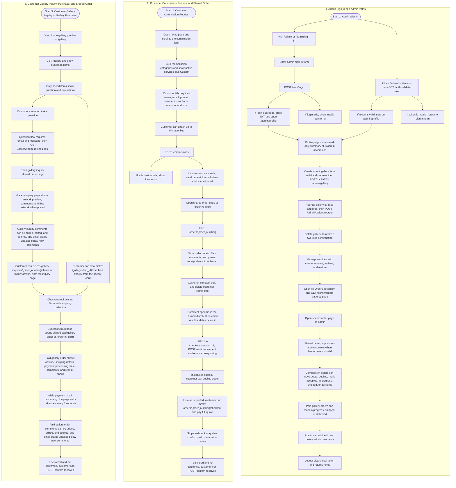

## App Flow

```mermaid
flowchart TB
  subgraph AdminFlow[1. Admin Sign In and Admin Paths]
    direction TB
    A0([Start 1: Admin Sign In])
    A1[Visit /admin or /admin/sign-in]
    A2[Show admin sign-in form]
    A3[POST /auth/login]
    A4[If login succeeds, store JWT and open /admin/profile]
    A5[If login fails, show invalid login error]
    A6[Direct /admin/profile visit runs GET /auth/validate-token]
    A7[If token is valid, stay on /admin/profile]
    A8[If token is invalid, return to sign-in form]
    A9[Profile page shows read-only summary plus admin accordions]
    A10[Create or edit gallery item with local preview, then POST or PATCH /admin/gallery]
    A11[Reorder gallery by drag and drop, then POST /admin/gallery/reorder]
    A12[Delete gallery item with a two-step confirmation]
    A13[Manage services with create, rename, archive, and restore]
    A14[Open All Orders accordion and GET /admin/orders page by page]
    A15[Open shared order page as admin]
    A16[Shared order page shows admin controls when bearer token is valid]
    A17[Commission orders can save quote, decline, mark accepted, in progress, shipped, or delivered]
    A18[Paid gallery orders can mark in progress, shipped, or delivered]
    A19[Admin can add, edit, and delete admin comments]
    A20[Logout clears local token and returns home]

    A0 --> A1 --> A2 --> A3
    A3 --> A4
    A3 --> A5
    A0 --> A6
    A6 --> A7
    A6 --> A8
    A4 --> A9 --> A10 --> A11 --> A12 --> A13 --> A14 --> A15 --> A16 --> A17 --> A18 --> A19 --> A20
    A7 --> A9
  end

  subgraph CommissionFlow[2. Customer Commission Request and Shared Order]
    direction TB
    B0([Start 2: Customer Commission Request])
    B1[Open home page and scroll to the commission form]
    B2[GET /commission-categories and show active services plus Custom]
    B3[Customer fills required name, email, phone, service, instructions, medium, and size]
    B4[Customer can attach up to 5 image files]
    B5[POST /commissions]
    B6[If submission fails, show form error]
    B7[If submission succeeds, send order-link email when mail is configured]
    B8["Open shared order page at /order/{6_digit}"]
    B9["GET /orders/{order_number}"]
    B10[Show order details, files, comments, and green receipt check if confirmed]
    B11[Customer can add, edit, and delete customer comments]
    B12[Comment appears in the UI immediately, then email result updates below it]
    B13[If URL has checkout_session_id, POST confirm-payment and remove query string]
    B14[If status is quoted, customer can decline quote]
    B15["If status is quoted, customer can POST /orders/{order_number}/checkout and pay full quote"]
    B16[Stripe webhook may also confirm paid commission orders]
    B17[If delivered and not confirmed, customer can POST confirm-received]

    B0 --> B1 --> B2 --> B3 --> B4 --> B5
    B5 --> B6
    B5 --> B7 --> B8 --> B9 --> B10 --> B11 --> B12 --> B13 --> B14 --> B15 --> B16 --> B17
  end

  subgraph GalleryFlow[3. Customer Gallery Inquiry, Purchase, and Shared Order]
    direction TB
    C0([Start 3: Customer Gallery Inquiry or Gallery Purchase])
    C1[Open home gallery preview or /gallery]
    C2[GET /gallery and show published items]
    C3[Only priced items show question and buy actions]
    C4[Customer can open Ask a question]
    C5["Question flow requires email and message, then POST /gallery/{item_id}/inquiries"]
    C6[Open gallery inquiry shared order page]
    C7[Gallery inquiry page shows artwork preview, comments, and Buy artwork when priced]
    C8[Gallery inquiry comments can be added, edited, and deleted, and email status updates below new comments]
    C9["Customer can POST /gallery-inquiries/{order_number}/checkout to buy artwork from the inquiry page"]
    C10["Customer can also POST /gallery/{item_id}/checkout directly from the gallery card"]
    C11[Checkout redirects to Stripe with shipping collection]
    C12["Successful purchase opens shared paid gallery order at /order/{6_digit}"]
    C13[Paid gallery order shows artwork, shipping details, payment-processing state, comments, and receipt check]
    C14[While payment is still processing, the page auto-refreshes every 3 seconds]
    C15[Paid gallery order comments can be added, edited, and deleted, and email status updates below new comments]
    C16[If delivered and not confirmed, customer can POST confirm-received]

    C0 --> C1 --> C2 --> C3 --> C4 --> C5 --> C6 --> C7 --> C8 --> C9 --> C11 --> C12 --> C13 --> C14 --> C15 --> C16
    C3 --> C10 --> C11
  end
```
