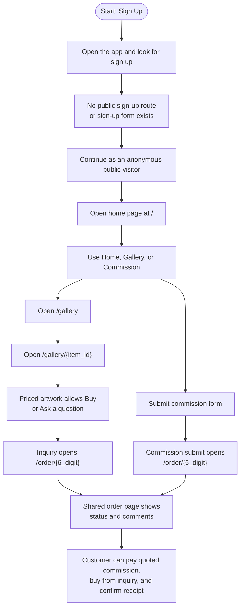
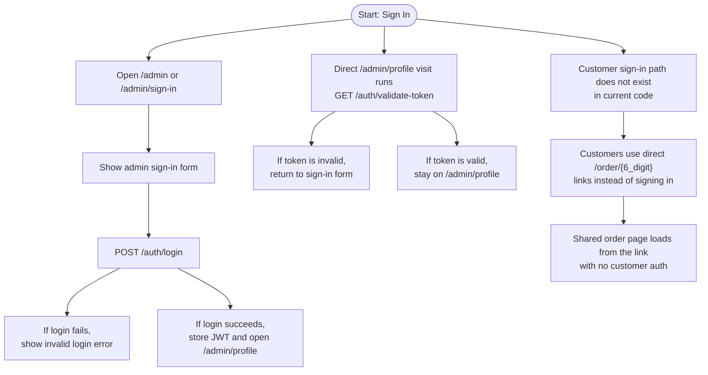
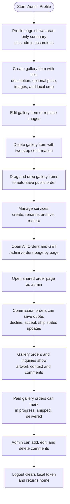
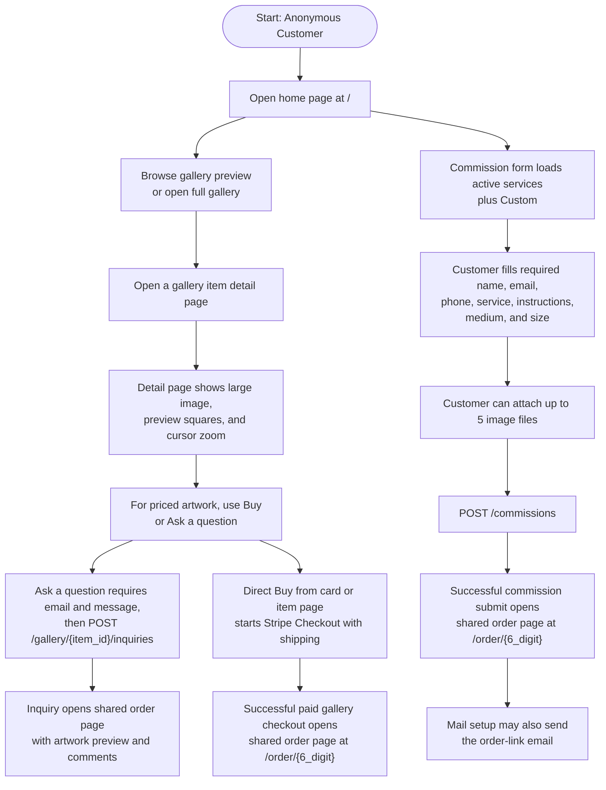
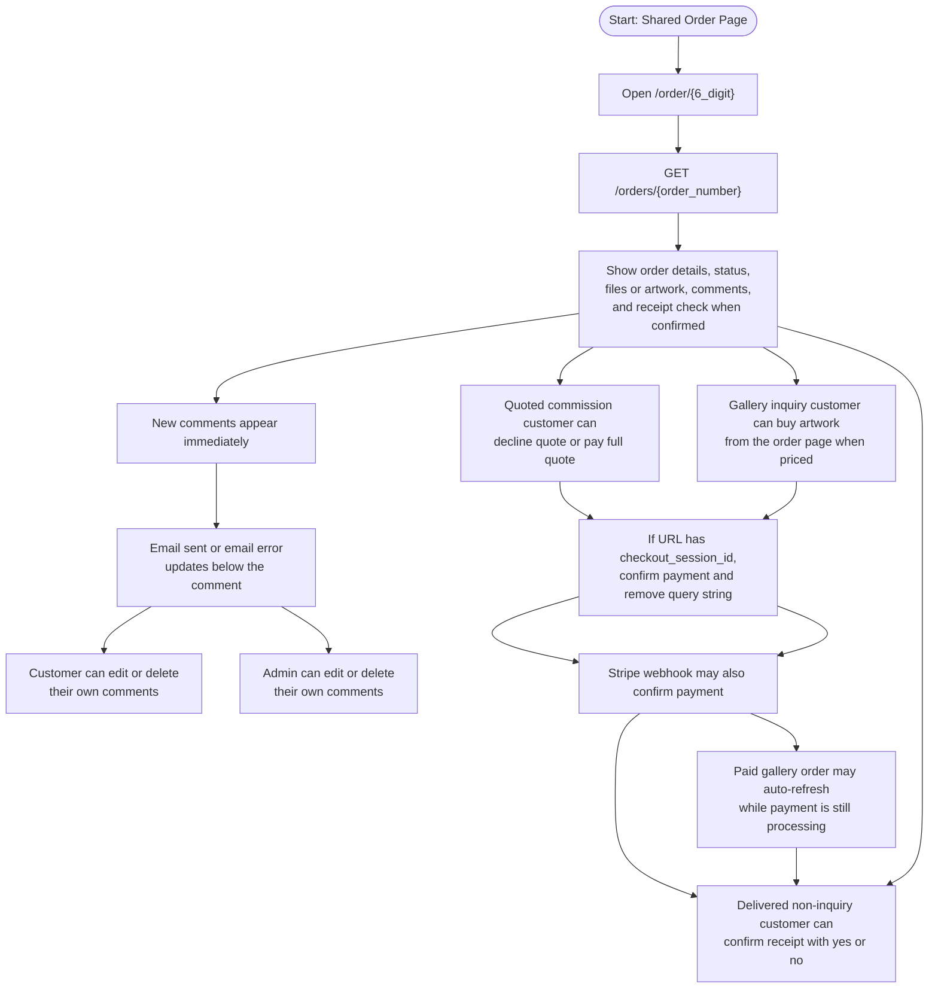

## Sign Up Start

```mermaid
flowchart TB
  S0([Start: Sign Up])
  S1["Open the app and look for sign up"]
  S2["No public sign-up route<br/>or sign-up form exists"]
  S3["Continue as an anonymous public visitor"]
  S4["Open home page at /"]
  S5["Use Home, Gallery, or Commission"]
  S6["Open /gallery"]
  S7["Open /gallery/{item_id}"]
  S8["Priced artwork allows Buy<br/>or Ask a question"]
  S9["Inquiry opens /order/{6_digit}"]
  S10["Submit commission form"]
  S11["Commission submit opens<br/>/order/{6_digit}"]
  S12["Shared order page shows<br/>status and comments"]
  S13["Customer can pay quoted commission,<br/>buy from inquiry, and confirm receipt"]

  S0 --> S1 --> S2 --> S3 --> S4 --> S5
  S5 --> S6 --> S7 --> S8 --> S9 --> S12 --> S13
  S5 --> S10 --> S11 --> S12
```

## Sign In Start

```mermaid
flowchart TB
  I0([Start: Sign In])
  I1["Open /admin or /admin/sign-in"]
  I2["Show admin sign-in form"]
  I3["POST /auth/login"]
  I4["If login fails,<br/>show invalid login error"]
  I5["If login succeeds,<br/>store JWT and open /admin/profile"]
  I6["Direct /admin/profile visit runs<br/>GET /auth/validate-token"]
  I7["If token is invalid,<br/>return to sign-in form"]
  I8["If token is valid,<br/>stay on /admin/profile"]
  I9["Customer sign-in path does not exist<br/>in current code"]
  I10["Customers use direct /order/{6_digit}<br/>links instead of signing in"]
  I11["Shared order page loads from the link<br/>with no customer auth"]

  I0 --> I1 --> I2 --> I3
  I3 --> I4
  I3 --> I5
  I0 --> I6
  I6 --> I7
  I6 --> I8
  I0 --> I9 --> I10 --> I11
```

## Admin Flow

```mermaid
flowchart TB
  A0([Start: Admin Profile])
  A1["Profile page shows read-only summary<br/>plus admin accordions"]
  A2["Create gallery item with title,<br/>description, optional price,<br/>images, and local crop"]
  A3["Edit gallery item or replace images"]
  A4["Delete gallery item with<br/>two-step confirmation"]
  A5["Drag and drop gallery items<br/>to auto-save public order"]
  A6["Manage services:<br/>create, rename, archive, restore"]
  A7["Open All Orders and GET<br/>/admin/orders page by page"]
  A8["Open shared order page as admin"]
  A9["Commission orders can save quote,<br/>decline, accept, ship status updates"]
  A10["Gallery orders and inquiries show<br/>artwork context and comments"]
  A11["Paid gallery orders can mark<br/>in progress, shipped, delivered"]
  A12["Admin can add, edit, and delete comments"]
  A13["Logout clears local token<br/>and returns home"]

  A0 --> A1 --> A2 --> A3 --> A4 --> A5 --> A6 --> A7 --> A8
  A8 --> A9 --> A10 --> A11 --> A12 --> A13
```

## Anonymous Customer Flow

```mermaid
flowchart TB
  C0([Start: Anonymous Customer])
  C1["Open home page at /"]
  C2["Browse gallery preview<br/>or open full gallery"]
  C3["Open a gallery item detail page"]
  C4["Detail page shows large image,<br/>preview squares, and cursor zoom"]
  C5["For priced artwork, use Buy<br/>or Ask a question"]
  C6["Ask a question requires email and message,<br/>then POST /gallery/{item_id}/inquiries"]
  C7["Inquiry opens shared order page<br/>with artwork preview and comments"]
  C8["Direct Buy from card or item page<br/>starts Stripe Checkout with shipping"]
  C9["Successful paid gallery checkout opens<br/>shared order page at /order/{6_digit}"]
  C10["Commission form loads active services<br/>plus Custom"]
  C11["Customer fills required name, email,<br/>phone, service, instructions,<br/>medium, and size"]
  C12["Customer can attach up to 5 image files"]
  C13["POST /commissions"]
  C14["Successful commission submit opens<br/>shared order page at /order/{6_digit}"]
  C15["Mail setup may also send<br/>the order-link email"]

  C0 --> C1 --> C2 --> C3 --> C4 --> C5
  C5 --> C6 --> C7
  C5 --> C8 --> C9
  C1 --> C10 --> C11 --> C12 --> C13 --> C14 --> C15
```

## Shared Order Flow

```mermaid
flowchart TB
  O0([Start: Shared Order Page])
  O1["Open /order/{6_digit}"]
  O2["GET /orders/{order_number}"]
  O3["Show order details, status,<br/>files or artwork, comments,<br/>and receipt check when confirmed"]
  O4["New comments appear immediately"]
  O5["Email sent or email error<br/>updates below the comment"]
  O6["Customer can edit or delete<br/>their own comments"]
  O7["Admin can edit or delete<br/>their own comments"]
  O8["Quoted commission customer can<br/>decline quote or pay full quote"]
  O9["Gallery inquiry customer can buy artwork<br/>from the order page when priced"]
  O10["If URL has checkout_session_id,<br/>confirm payment and remove query string"]
  O11["Stripe webhook may also confirm payment"]
  O12["Paid gallery order may auto-refresh<br/>while payment is still processing"]
  O13["Delivered non-inquiry customer can<br/>confirm receipt with yes or no"]

  O0 --> O1 --> O2 --> O3 --> O4 --> O5
  O5 --> O6
  O5 --> O7
  O3 --> O8 --> O10 --> O11 --> O13
  O3 --> O9 --> O10 --> O11 --> O12 --> O13
  O3 --> O13
```
