# Saved & Single

The source Mermaid diagrams live in [flowchart.md](flowchart.md).
The rendered SVGs below are what GitHub mobile can reliably display in the repo overview.

## App Flow



## Matching Algorithm Flow



## Health Check

For a minimal backend ops check, call:

```bash
curl http://localhost:5001/api/user/health
```

The response shows basic database connectivity plus the latest embedded scheduler auto-complete run.
