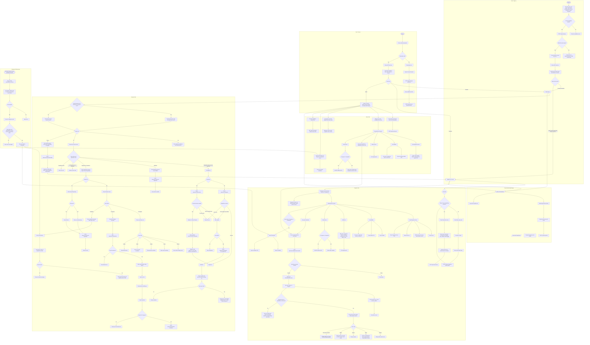
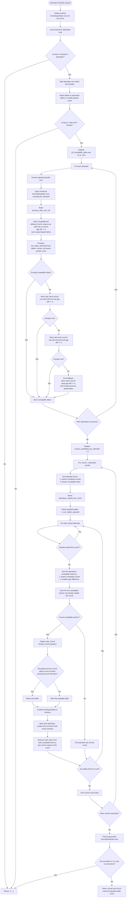

## App Flow

```mermaid
flowchart TD
  subgraph SignupFlow[Start 1: Sign Up]
    SU0([Sign Up]) --> SU1[Enter first name, last name, email, phone, birthday, gender, church, password, confirm password]
    SU1 --> SU2{Frontend validation passes?}
    SU2 -- No --> SU3[Show form validation errors]
    SU2 -- Yes --> SU4[POST /api/user/signup]
    SU4 --> SU5{Backend accepts signup?}
    SU5 -- No --> SU6[Show API error<br/>duplicate email or invalid gender/input]
    SU5 -- Yes --> SU7[Create attendee account<br/>role_id = 1]
    SU7 --> SU8[Return JWT and user]
    SU8 --> SU9[AuthContext persists token and redirects to /events]
    SU9 --> SU10{Signed-up user path}
    SU10 -->|Use app as attendee| ATT0
    SU10 -->|Open Create tab and start Stripe setup later| ORG0
  end

  subgraph SigninFlow[Start 2: Sign In]
    SI0([Sign In]) --> SI1[Enter email and password]
    SI1 --> SI2{Credentials valid?}
    SI2 -- No --> SI3[Show login error]
    SI3 --> SI4[Optional Forgot Password]
    SI4 --> SI5[POST /api/user/forgot-password]
    SI5 --> SI6[Open emailed reset link]
    SI6 --> SI7[POST /api/user/reset-password/:token]
    SI2 -- Yes --> SI8[Return JWT and user]
    SI8 --> SI9[AuthContext validates token and redirects to /events]
    SI9 --> SI10{Current role}
    SI10 -->|Attendee| ATT0
    SI10 -->|Organizer| ORG0
    SI10 -->|Admin| ADM0
  end

  subgraph SharedPages[Shared Authenticated Pages]
    SH0[/events via PrivateRoute/]
    SH1[/profile via PrivateRoute/]
    SH2[Top-right username opens Profile]
    SH1 --> SH3[Read-only profile card rows]
    SH3 --> SH4[Header pencil opens edit mode]
    SH4 --> SH5[PATCH /api/user/profile]
    SH1 --> SH6[Log out from profile card]
  end

  subgraph AttendeePath[Attendee Path]
    ATT0[Events page] --> ATT1{Default attendee has a checked-in In Progress event?}
    ATT1 -- Yes --> ATT2[EventContext shows only that single active event]
    ATT1 -- No --> ATT3[EventContext shows normal event list]

    ATT2 --> ATT4{Choose tab}
    ATT3 --> ATT4
    ATT4 -->|My| ATT5[Show registered, waitlisted, and created events]
    ATT4 -->|All| ATT6[Show all non-mock events]
    ATT4 -->|Create| ATT7[Show Stripe organizer setup card if onboarding incomplete]

    ATT7 --> ATT8[POST /api/user/connect/onboarding]
    ATT8 --> ATT9[Return from Stripe and POST /api/user/organizer-status/refresh]
    ATT9 --> ORG0

    ATT6 --> ATT10{Event status and registration state}
    ATT10 -->|Registration Open and not registered| ATT11[Tap Sign Up]
    ATT10 -->|Waitlisted| ATT12[Show Waitlisted chip and Leave Waitlist]
    ATT10 -->|Registered or Checked In| ATT13[Show registration chip and maybe Cancel Registration]
    ATT10 -->|In Progress but not registered| ATT14[Read-only event card]
    ATT10 -->|Completed or past| ATT15[Past event card]

    ATT11 --> ATT16{Paid event?}
    ATT16 -- No --> ATT17[POST /api/events/:id/register]
    ATT17 --> ATT18{Registration outcome}
    ATT18 -->|Success| ATT19[Registered]
    ATT18 -->|Full or gender cap reached| ATT20[Offer waitlist]
    ATT18 -->|Other error| ATT21[Show API error]

    ATT16 -- Yes --> ATT22[POST /api/events/:id/checkout]
    ATT22 --> ATT23{Checkout session created?}
    ATT23 -- No: full or gender cap --> ATT20
    ATT23 -- No: other error --> ATT21
    ATT23 -- Yes --> ATT24[Redirect to Stripe Checkout]
    ATT24 --> ATT25[Stripe webhook checkout.session.completed]
    ATT25 --> ATT26[Webhook calls register_for_event with payment_confirmed=true]
    ATT26 --> ATT19

    ATT20 --> ATT27{Join waitlist?}
    ATT27 -- Yes --> ATT28[POST /api/events/:id/register<br/>join_waitlist=true]
    ATT28 --> ATT29[Waitlisted]
    ATT27 -- No --> ATT30[Stay unregistered]

    ATT12 --> ATT31[POST /api/events/:id/cancel-registration]
    ATT31 --> ATT32[Removed from waitlist]

    ATT13 --> ATT33{Checked In?}
    ATT33 -- Yes --> ATT34[Show Checked In chip]
    ATT33 -- No --> ATT35[Allow Cancel Registration]
    ATT35 --> ATT36{Paid event?}
    ATT36 -- Yes --> ATT37[Show no-refund warning]
    ATT36 -- No --> ATT38[Cancel directly]
    ATT37 --> ATT39[POST /api/events/:id/cancel-registration]
    ATT38 --> ATT39
    ATT39 --> ATT40[Refresh events]

    ATT29 --> ATT41[Stay on waitlist until attendee returns and signs up]
    ATT41 --> ATT42{Spot opens later?}
    ATT42 -- Yes --> ATT43[Backend may email eligible waitlisted users to come back and sign up]
    ATT42 -- No --> ATT44[Remain waitlisted]

    ATT34 --> ATT45{Event status}
    ATT45 -->|In Progress| ATT46[Show round timer card]
    ATT45 -->|In Progress| ATT47[Show My Schedule accordion]
    ATT45 -->|Completed| ATT48[Show completed schedule with match results]

    ATT46 --> ATT49{Timer state}
    ATT49 -->|Inactive| ATT50[Event will be starting shortly]
    ATT49 -->|Active| ATT51[Show round countdown]
    ATT49 -->|Paused| ATT52[Show paused countdown]
    ATT49 -->|Break| ATT53[Show next-round countdown]
    ATT49 -->|Ended| ATT54[Show finished state]

    ATT47 --> ATT55[GET /api/events/:id/schedule]
    ATT55 --> ATT56{Round has partner?}
    ATT56 -- Yes --> ATT57[Show round number, table, partner]
    ATT56 -- No --> ATT58[Show Break Round]
    ATT57 --> ATT59[Tap Yes or No]
    ATT59 --> ATT60[Persist pick in localStorage]
    ATT60 --> ATT61[Save Selections]
    ATT61 --> ATT62{Event still In Progress?}
    ATT62 -- Yes --> ATT63[POST /api/events/:id/submit-selections]
    ATT62 -- No --> ATT64[Only keep local saved state]

    ATT48 --> ATT65[Hide Yes/No buttons]
    ATT65 --> ATT66[Show partner name as completed card title]
    ATT66 --> ATT67{Mutual match?}
    ATT67 -- Yes --> ATT68[Show match message and copyable partner email]
    ATT67 -- No --> ATT69[Show not-a-match message]

    ATT0 --> SH1
  end

  subgraph OrganizerPath[Organizer Path]
    ORG0[Organizer on /events] --> ORG1{Create tab}
    ORG1 --> ORG2{Stripe Connect onboarding complete?}
    ORG2 -- No --> ORG3[Show Stripe setup card]
    ORG3 --> ORG4[Continue to Stripe]
    ORG4 --> ORG5[Return and Check Setup]
    ORG5 --> ORG6[POST /api/user/organizer-status/refresh]
    ORG6 --> ORG2
    ORG2 -- Yes --> ORG7[Show Create Event form]
    ORG7 --> ORG8[Enter name, description, local starts_at, capacity, price, address, 60/40 toggle]
    ORG8 --> ORG9[Minimum ticket price enforced by fee schedule]
    ORG9 --> ORG10[POST /api/events/create]

    ORG0 --> ORG11[Manage only events where creator_id = organizer id]
    ORG11 --> ORG12[Expand Event Controls]
    ORG12 --> ORG13[View Registered Users]
    ORG13 --> ORG14[Search users]
    ORG13 --> ORG15[Edit first name, last name, email, gender, church]
    ORG13 --> ORG16[Manual Check In]
    ORG13 --> ORG17[Export registered-users CSV]

    ORG12 --> ORG18[View Waitlist]
    ORG18 --> ORG19[Search waitlist]
    ORG18 --> ORG20[Export waitlist CSV]
    ORG18 --> ORG21[No move-to-registered action in current UI]

    ORG12 --> ORG22[Edit Event]
    ORG22 --> ORG23[Edit name, description, starts_at, address, capacity, price, 60/40 toggle, status]
    ORG23 --> ORG24[PUT /api/events/:id]

    ORG12 --> ORG25[Delete Event]
    ORG25 --> ORG26{In Progress or Completed?}
    ORG26 -- Yes --> ORG27[Delete button disabled]
    ORG26 -- No --> ORG28[DELETE /api/events/:id]

    ORG12 --> ORG29[Generate Schedules]
    ORG29 --> ORG30[Choose requested tables and rounds]
    ORG30 --> ORG31[POST /api/events/:id/generate/schedules]
    ORG31 --> ORG32{Schedule generation outcome}
    ORG32 -- Failure --> ORG33[Show failure]
    ORG32 -- Success --> ORG34[Delete old EventSpeedDate rows]
    ORG34 --> ORG35[Set event status to In Progress]
    ORG35 --> ORG36[Persist actual num_rounds and num_tables]
    ORG36 --> ORG37[Reset timer record]

    ORG12 --> ORG38{Event status In Progress or Completed?}
    ORG38 -- Yes --> ORG39[View All Schedules]
    ORG39 --> ORG40[Search schedules]
    ORG39 --> ORG41[Export schedules CSV]

    ORG35 --> ORG42{Organizer also has registration on this event?}
    ORG42 -- Yes --> ORG43[Round Timer panel renders with manager controls]
    ORG42 -- No --> ORG44[Current UI hides timer panel even though organizer can still manage event data]

    ORG43 --> ORG45{Timer state}
    ORG45 -->|Inactive| ORG46[Primary button starts round]
    ORG45 -->|Active| ORG47[Previous restarts/jumps back, primary pauses, forward skips to break]
    ORG45 -->|Paused| ORG48[Primary resumes]
    ORG45 -->|Break| ORG49[Primary starts next round, previous restarts current round]
    ORG45 -->|Not active or paused| ORG50[Settings dialog can change round and break durations]

    ORG11 --> ORG51[Organizer can also use normal attendee signup flow for events]
    ORG0 --> SH1
  end

  subgraph AdminPath[Admin Path]
    ADM0[Admin on /events<br/>admin account created manually outside signup] --> ADM1[Create tab opens Create Event form immediately]
    ADM1 --> ADM2[POST /api/events/create]

    ADM0 --> ADM3[Manage any event, including mock events]
    ADM3 --> ADM4[Expand Event Controls]
    ADM4 --> ADM5[View Registered Users]
    ADM5 --> ADM6[Search, edit attendee details, manual check in, export CSV]

    ADM4 --> ADM7[View Waitlist]
    ADM7 --> ADM8[Search and export waitlist CSV]
    ADM7 --> ADM9[No move-to-registered action in current UI]

    ADM4 --> ADM10[Edit any event]
    ADM10 --> ADM11[PUT /api/events/:id]

    ADM4 --> ADM12[Generate Schedules for Registration Open event]
    ADM12 --> ORG30

    ADM4 --> ADM13[Delete Event]
    ADM13 --> ADM14{In Progress or Completed?}
    ADM14 -- Yes --> ADM15[Delete button disabled and backend also blocks delete]
    ADM14 -- No --> ADM16[DELETE /api/events/:id]

    ADM0 --> ADM17[In-progress event card always shows timer panel]
    ADM17 --> ADM18[Manager controls match organizer timer controls]
    ADM0 --> ADM19[View All Schedules for In Progress or Completed event]
    ADM19 --> ADM20[Search and export schedules]
    ADM0 --> ADM21[No match visibility in product flow]
    ADM21 --> ADM22[GET /api/events/:id/all-matches returns 403]
    ADM0 --> SH1
  end

  subgraph MaintenanceFlow[Background Maintenance]
    MT0([Flask app entrypoint starts embedded scheduler]) --> MT1[Daily 9:00 AM America/New_York job]
    MT1 --> MT2[Try Postgres advisory lock so only one app process runs the job]
    MT2 --> MT3{Lock acquired?}
    MT3 -- No --> MT4[Skip this run]
    MT3 -- Yes --> MT5[Find all In Progress events]
    MT5 --> MT6{Event starts_at in America/New_York is before current Eastern date?}
    MT6 -- Yes --> MT7[Set event status to Completed]
    MT6 -- No --> MT8[Leave event unchanged]
    MT7 --> ATT65
    MT7 --> ORG39
    MT7 --> ADM19
  end
```

## Matching Algorithm Flow

```mermaid
flowchart TD
  MA0([Generate schedule request]) --> MA1[Delete existing EventSpeedDate rows for this event]
  MA1 --> MA2[Load checked-in attendees only]
  MA2 --> MA3{At least 2 checked-in attendees?}
  MA3 -- No --> MA4[Return -1, -1]
  MA3 -- Yes --> MA5[Split attendees into males and females]
  MA5 --> MA6[Adjust tables to requested tables or smaller gender count]
  MA6 --> MA7{At least 1 male and 1 female?}
  MA7 -- No --> MA4
  MA7 -- Yes --> MA8[Initialize all_compatible_dates and id_to_user]

  MA8 --> MA9[For each attendee]
  MA9 --> MA10[Choose opposite-gender pool]
  MA10 --> MA11[Query historical EventSpeedDate rows involving this attendee]
  MA11 --> MA12[Build previous_date_user_ids]
  MA12 --> MA13[Initial compatible list:<br/>different church unless one side has no church<br/>age diff <= 3<br/>never speed-dated before]
  MA13 --> MA14[Compute min_dates_threshold from tables, rounds, and same-gender count]
  MA14 --> MA15{Enough compatible dates?}
  MA15 -- Yes --> MA20[Store compatible dates]
  MA15 -- No --> MA16[Retry with same church rule still enforced and age diff <= 4]
  MA16 --> MA17{Enough now?}
  MA17 -- Yes --> MA20
  MA17 -- No --> MA18[Retry with same church rule still enforced and age diff <= 5]
  MA18 --> MA19{Enough now?}
  MA19 -- Yes --> MA20
  MA19 -- No --> MA21[Final fallback:<br/>allow same church<br/>keep age diff <= 5<br/>still exclude previous speed dates]
  MA21 --> MA20

  MA20 --> MA22{More attendees to process?}
  MA22 -- Yes --> MA9
  MA22 -- No --> MA23[Initialize rounds_completed_per_attendee = 0]

  MA23 --> MA24[For round 1..requested rounds]
  MA24 --> MA25[Sort attendee ids by:<br/>1. fewest completed rounds<br/>2. fewest compatible dates]
  MA25 --> MA26[Reset attendees_seated_this_round]
  MA26 --> MA27[Reset available tables 1..num_tables_adjusted]
  MA27 --> MA28[For each sorted attendee]
  MA28 --> MA29{Already seated this round?}
  MA29 -- Yes --> MA28
  MA29 -- No --> MA30[Sort this attendee's compatible dates by:<br/>1. fewest completed rounds<br/>2. smallest age difference]
  MA30 --> MA31[Scan for first compatible partner not already seated this round]
  MA31 --> MA32{Found compatible partner?}
  MA32 -- No --> MA33[This attendee sits out this round]
  MA32 -- Yes --> MA34[Assign male_id and female_id from genders]
  MA34 --> MA35{Reusable previous-round table for one of these participants and still open?}
  MA35 -- Yes --> MA36[Reuse that table]
  MA35 -- No --> MA37[Take first available table]
  MA36 --> MA38[Create EventSpeedDate in memory]
  MA37 --> MA38
  MA38 --> MA39[Mark both attendees seated and increment both round counters]
  MA39 --> MA40[Remove each other from both compatible lists so pair cannot repeat in this event]
  MA40 --> MA41{Any tables left this round?}
  MA41 -- No --> MA42[End current round early]
  MA41 -- Yes --> MA28
  MA33 --> MA41
  MA42 --> MA43{More rounds requested?}
  MA43 -- Yes --> MA24
  MA43 -- No --> MA44[Persist generated EventSpeedDate rows]
  MA44 --> MA45{Any exception or no rows to summarize?}
  MA45 -- Yes --> MA4
  MA45 -- No --> MA46[Return actual max round used and adjusted table count]
```
