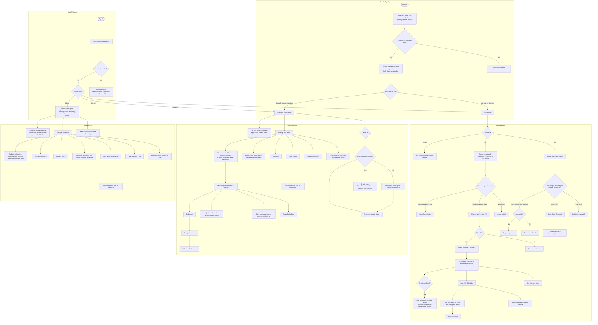

```mermaid
flowchart TD
  subgraph SignupFlow[Start 1: Sign Up]
    SU0([Sign Up]) --> SU1[Enter first name, last name, email, phone, birthday, gender, church, password]
    SU1 --> SU2{Valid form and unique email?}
    SU2 -- No --> SU3[Show validation or duplicate-email error]
    SU2 -- Yes --> SU4[Account created and auto signed in<br/>Role starts as attendee]
    SU4 --> SU5{Post-sign-up path}
    SU5 -->|Use app as attendee| ATT0
    SU5 -->|Upgrade later to organizer| ORG0
  end

  subgraph SigninFlow[Start 2: Sign In]
    SI0([Sign In]) --> SI1[Enter email and password]
    SI1 --> SI2{Credentials valid?}
    SI2 -- No --> SI3[Show login error<br/>Optional Forgot Password / Reset Password flow]
    SI2 -- Yes --> SI4{Signed-in role}
    SI4 -->|Attendee| ATT0
    SI4 -->|Organizer| ORG0
    SI4 -->|Admin| ADM0
  end

  subgraph AttendeePath[Attendee Path]
    ATT0[Events page] --> ATT1{Choose tab}
    ATT1 -->|All| ATT2[Browse upcoming events]
    ATT1 -->|My| ATT3[See my registered, waitlisted, created, and past events]
    ATT1 -->|Create| ATT4[See Stripe organizer setup prompt]

    ATT2 --> ATT5{Registration open and not already registered?}
    ATT5 -->|Free event| ATT6[Register immediately]
    ATT5 -->|Paid event| ATT7[Go to Stripe Checkout]
    ATT7 --> ATT8[Checkout success webhook registers attendee]
    ATT5 -->|Full or gender cap reached| ATT9{Join waitlist?}
    ATT9 -->|Yes| ATT10[Become waitlisted]
    ATT9 -->|No| ATT11[Stay unregistered]

    ATT3 --> ATT12{Current registration state}
    ATT12 -->|Waitlisted| ATT13[Leave waitlist]
    ATT12 -->|Registered before start| ATT14[Check in with 4-digit PIN]
    ATT12 -->|Registered before start| ATT15[Cancel registration]
    ATT14 --> ATT16{PIN valid?}
    ATT16 -- No --> ATT17[Show check-in error]
    ATT16 -- Yes --> ATT18[Status becomes Checked In]

    ATT18 --> ATT19[In-progress checked-in event becomes the attendee's visible event focus]
    ATT19 --> ATT20[See attendee timer]
    ATT19 --> ATT21[Open My Schedule]
    ATT21 --> ATT22[See round, table, partner, or break]
    ATT21 --> ATT23[Tap Yes or No for each date during the event]
    ATT23 --> ATT24[Save selections]
    ATT19 --> ATT25{Event completed?}
    ATT25 -->|Yes| ATT26[See completed schedule results<br/>Mutual matches show partner email to copy]
  end

  subgraph OrganizerPath[Organizer Path]
    ORG0[Organizer events page] --> ORG1{Create tab}
    ORG1 --> ORG2{Stripe Connect complete?}
    ORG2 -- No --> ORG3[Continue or finish Stripe Connect onboarding]
    ORG3 --> ORG4[Refresh organizer status]
    ORG4 --> ORG2
    ORG2 -- Yes --> ORG5[Create event<br/>Price floor enforced from platform fee schedule]

    ORG0 --> ORG6[Manage own event]
    ORG6 --> ORG7[View registered users and edit attendee details]
    ORG6 --> ORG8[View attendee PINs]
    ORG6 --> ORG9[View waitlist]
    ORG9 --> ORG10[Move waitlisted user to registered]
    ORG6 --> ORG11[Edit event]
    ORG6 --> ORG12[Delete event before it is in progress or completed]
    ORG6 --> ORG13[Generate schedules from Registration Open<br/>Choose number of tables and rounds]
    ORG13 --> ORG14[Event status changes to In Progress]
    ORG14 --> ORG15[View all schedules]
    ORG14 --> ORG16[Control timer<br/>Start, end round, pause, resume, next round]
    ORG14 --> ORG17[Adjust round duration before a round starts]
    ORG14 --> ORG18[End event]
    ORG18 --> ORG19[Completed event]
    ORG19 --> ORG20[Still view all schedules]
    ORG0 --> ORG21[Can also use the attendee registration, waitlist, check-in, and schedule flow]
  end

  subgraph AdminPath[Admin Path]
    ADM0[Admin events page<br/>Admin account is created manually outside normal sign-up] --> ADM1[Create event without Stripe onboarding]
    ADM0 --> ADM2[Manage any event]
    ADM2 --> ADM3[View and export registered users]
    ADM2 --> ADM4[View attendee PINs]
    ADM2 --> ADM5[View and export waitlist]
    ADM5 --> ADM6[Move waitlisted user to registered]
    ADM2 --> ADM7[Generate schedules and control timer for any event]
    ADM2 --> ADM8[Edit any event]
    ADM2 --> ADM9[View all schedules]
    ADM2 --> ADM10[Backend-only admin endpoints exist for listing users and changing roles]
    ADM0 --> ADM11[Can also use the attendee registration, waitlist, check-in, and schedule flow]
  end
```
